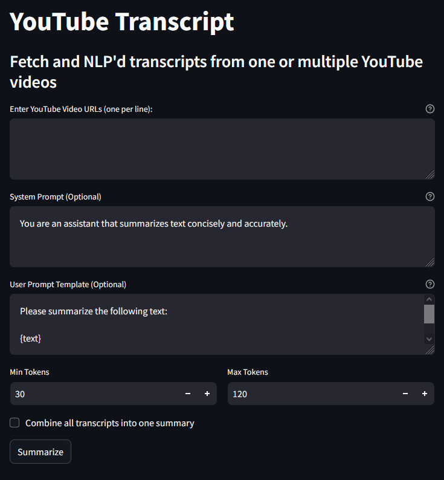

# YouTube Transcript Summarizer



A **Streamlit** application that fetches YouTube video transcripts, applies NLP summarization, and presents concise summaries. The app also supports login functionality with encrypted cookies and allows users to customize the summarization process.

## Features

- **Fetch Transcripts**: Retrieve transcripts for one or multiple YouTube videos.
- **Custom Prompts**: Customize system and user prompts for summarization.
- **Token Control**: Specify minimum and maximum token limits for summaries.
- **Batch Summarization**: Summarize individual videos or combine transcripts for a single summary.
- **Secure Login**: Login with username and password, and optionally remember users using encrypted cookies.

---

## Installation

1. Clone the repository:

   ```
   git clone https://github.com/norhther/YT-summarizer
   cd YT-summarizer
   ```

2. Create and activate a virtual environment:

   ```
   python -m venv venv
   source venv/bin/activate  # On Windows: venv\Scripts\activate
   ```

3. Install the required dependencies:

   ```
   pip install -r requirements.txt
   ```

4. Create a `.env` file in the project root directory with the following structure:

   ```
   TOKEN=your-chatgpt-token
   APP_USERNAME=your-username
   APP_PASSWORD=your-password
   ```

   Replace `your-chatgpt-token`, `your-username`, and `your-password` with appropriate values.

---

## Usage

1. Run the Streamlit app:

   ```
   streamlit run app.py
   ```

2. Open the provided local URL in your browser.

3. **Login**: Enter the username and password specified in the `.env` file. Optionally, check "Remember Me" to stay logged in across sessions.

4. Enter one or more YouTube video URLs (each on a new line) and adjust the prompts and token limits as needed.

5. Click **Summarize** to fetch transcripts and generate summaries.

---

## Project Structure

- **`app.py`**: The main application file.
- **`transcript_fetcher.py`**: Handles fetching YouTube transcripts.
- **`summarizer.py`**: Implements text summarization logic.
- **`.env`**: Environment variables for login and API configuration.
- **`requirements.txt`**: Python dependencies.
